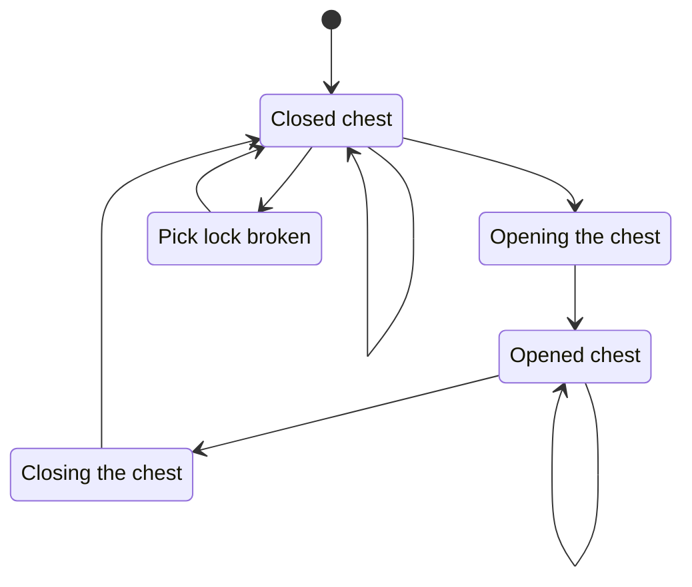

# MDS - model animation script

!!! Tip
    The MDS syntax is very simple and scripts can be edited in any text editor. It is, however, easier to work in an editor with a proper syntax highlighting. [Daedalus Language Server](https://github.com/kirides/vscode-daedalus/releases)'s dev branch already merged the MDS grammar for syntax highlighting, we can expect it in the next release.

Model animation script is a file describing what skeleton should be used, what body meshes work with this set of animations and how should the animations be named, how fast they run, what animation is supposed to start after the current one is finished and much more. These files are located in `Gothic\_work\DATA\Anims\` directory.

Whilst the code seems long and terrifying, it is in fact rather simple, and this guide will try to explain it whole.

!!! hint "Don't forget to use the search"
    If you search this file for `t_Yes`, you will get an example of the first type of animation - "standalone"

    To play the animation in game you use this console command `play ani t_yes`.

    


## Syntax and keywords

Let us get a quick look at the naming convention to get a basic idea what is going on before we start.

The first letter indicates a type of animation (transition - `t_` - or state - `s_`).
Then depending on the animation type we have:

**Transition animation**
```
t_Run_2_Sneak
```
Transition animation from the run animation to the sneak animation.
```
t_BSANVIL_Stand_2_S0
```
Transition animation for the blacksmith's anvil from standing to state 0.

**State animation**
```
s_Run
```
State animation for the looping animation.
```
s_BSANVIL_S0
```
State animation for the blacksmith's anvil and its first state.

### ani
This is the main command you will be using while defining new animations.

Example:
```dae
ani	("t_Yes" 2 "" 0.1 0.1 M. "Hum_Yes_M01.asc" F 1 44)
```
Syntax:
```dae
ani (ANI_NAME LAYER NEXT_ANI BLEND_IN BLEND_OUT FLAGS ASC_NAME ANI_DIR START_FRAME END_FRAME)
```
`ani` - is a keyword, we are defining new animation

Let's describe all the parameters

`ANI_NAME`    - animation name, we use it in Daedalus as animation identifier

There is a naming convention, that is recommended and sometimes required to be used.

- prefix `t_` - transition animations
- prefix `s_` - state animations - they usually run in a loop
- prefix `c_` - animations used for animation combining/interpolation

`LAYER`       - layer number for multi-layer animations

`NEXT_ANI`    - name of the next animations

`BLEND_IN`    - time in seconds describing animation blending at the start

If we set it to 0.5, it takes 0.5 seconds for this animation to take full effect. At 0.0 s the previous animation has full effect on the bones of the skeleton, at 0.1 s it is influenced by 20% by this animation and at 0.5s it is completely influenced by this animation and the previous one has no effect.

`BLEND_OUT`   - time in seconds describing animation blending at the end

`FLAGS`       - flags, that describe animation behavior

- **M** - specifies a movement animation, the animation of the model translates into a changed position in the game world
- **R** - the same as M but for rotation
- **E** - this flag makes this animation run only, if the animation in the same layer are finished, this is used in the movement animations. The animation `s_walk` (walking loop animation) runs, when the player is walking,when he stops the transition animation to standing state is played `t_walk_2_stand`. This animation uses the E flag to wait for the walk cycle animation to finish, to smoothly transition into the standing state.
- **F** - the engine ignores height coordinate - doesn't keep the model "glued" to the ground (falling/flying animation)
- **I** - specifies idle animation - breathing, standing with a drawn weapon and moving the weapon

`ASC_NAME`    - name of the source file exported from Blender

`ANI_DIR`     - direction of the animation

- **F** - forward
- **R** - reverse

`START_FRAME` - on what frame from the source file the animation starts

`END_FRAME`   - on what frame from the source file the animation ends

### aniAlias
Generally considered as one of the most useful commands, `aniAlias` is used to create an alias (hard link for UNIX users) for an already defined animation.

Example:
```dae
aniAlias ("t_Sneak_2_Run" 1 "s_Run" 0.0	0.1	M. "t_Run_2_Sneak" R)
```
Syntax:
```dae
aniAlias (ANI_NAME LAYER NEXT_ANI BLEND_IN BLEND_OUT FLAGS ALIAS_NAME ANI_DIR)
```

`ANI_NAME`   - name of the new animation

`LAYER`      - layer the animation is on

`NEXT_ANI`   - name of the next animations

`BLEND_IN`   - time in seconds describing animation blending at the start

`BLEND_OUT`  - time in seconds describing animation blending at the end

`FLAGS`      - flags, that describe animation behavior

`ALIAS_NAME` - name of the animation we want to use as a source for the alias

`ANI_DIR`    - direction of the animation

If we look for the animation in the example we can see that there is a related one just one line above
```dae
ani			("t_Run_2_Sneak" 1 "s_Sneak" 0.1 0.0 M. "Hum_Sneak_M01.asc"	 F 0 10)
aniAlias	("t_Sneak_2_Run" 1 "s_Run" 	 0.0 0.1 M. "t_Run_2_Sneak"      R)
```
In this example we are defining `t_Sneak_2_Run` animation and we are specifying that the animation after this one is finished will be `s_Run` and that it is being made by reversing animation `t_Run_2_Sneak` by specifying the `R` flag.

### aniBlend
AniBlend is used to define animations that are a result of blending of two animations. This animation is not animated by hand, but it is dynamically generated by the engine during run-time.

Example
```dae
aniBlend ("t_RunR_2_Run" "s_Run" 0.2 0.2)
```
Syntax:
```dae
aniBlend (ANI_NAME NEXT_ANI BLEND_IN BLEND_OUT)
```

`ANI_NAME`   - name of the new animation

`NEXT_ANI`   - name of the next animations

`BLEND_IN`   - time in seconds describing animation blending at the start

`BLEND_OUT`  - time in seconds describing animation blending at the end


### aniSync
Not used in the game.

### aniBatch
Not used in the game.

## Animation state machine
More complex animations such as MOBSI animations form a state machine - an animation set.

```dae title="MDS script for the big chest"
Model ("CHESTBIG_OCCRATELARGE")
{
    meshAndTree ("CHESTBIG_OCCRATELARGE.asc")

    aniEnum
    {
// Closed chest
        ani         ("s_S0"                 1   "s_S0"  0.0 0.0 M.  "CHESTBIG_USE.asc"  F   20  20)
// Opening the chest 
        ani         ("t_S0_2_S1"            1   "s_S1"  0.0 0.0 M.  "CHESTBIG_USE.ASC"  F   50  79)
        {
            *eventSFX   (50 "chest_try")
            *eventSFX   (55 "chest_open")
        }
// Opened chest
        ani         ("s_S1"                 1   "s_S1"  0.0 0.0 M.  "CHESTBIG_USE.asc"  F   80  80)
// Closing the chest
        ani         ("t_S1_2_S0"            1   "s_S0"  0.0 0.0 M.  "CHESTBIG_USE.asc"  R   50  79)
        {
            *eventSFX   (78 "chest_close")
        }
// Pick lock broken
        ani         ("t_S0_Try"             1   "s_S0"  0.0 0.0 M.  "CHESTBIG_USE.asc"          F   96  124)
        {
            *eventSFX   (100    "chest_try")
            *eventSFX   (115    "Hammer")
        }
    }
}
```

