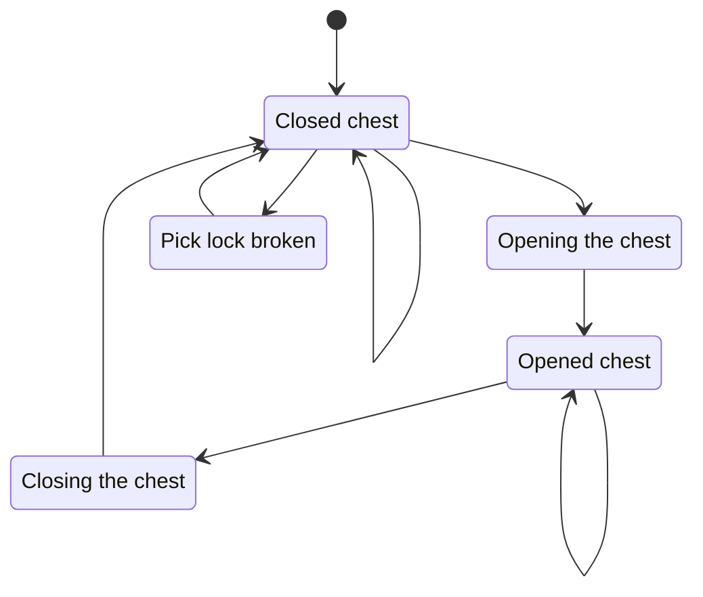

# MDS - Model Script
Model script is a file describing what skeleton should be used, what body meshes work with this set of animations and how should the animations be named, how fast they run, what animation is supposed to start after the current one is finished and much more.

!!! Info
    If you are unfamiliar with the animation naming conventions, please read the [naming conventions](naming.md) article first.

## Syntax
The MDS file consists of blocks and commands. Blocks are wrapped in curly braces `{}` and commands are single lines that end with a newline character.

**Comments**

Comments start with `//` and continue to the end of the line.
```dae
// This is a comment
```

!!! Tip
    The MDS syntax is very simple and scripts can be edited in any text editor. It is, however, easier to work in an editor with a proper syntax highlighting. [vscode-daedalus](../tools/daedalus_tools/daedalus_language_server.md) extension for Visual Studio Code supports MDS syntax highlighting.

## Model
The whole script is wrapped in the `Model` block. It defines the name of the model this script belongs to.
```dae
Model ("MODEL_NAME")
{
    //...
}
```

### meshAndTree
This command defines the source file for the model mesh and skeleton in the neutral pose.
```dae
meshAndTree ("ASC_NAME" DONT_USE_MESH)
```
**Parameters**

`ASC_NAME` - name of the source file  
`DONT_USE_MESH` - optional parameter, if specified the mesh from the source file is not used, only the skeleton. This is used for humans and creatures, since different meshes could use the same skeleton.

### registerMesh
This command registers a body mesh that can be used with this model (e.g armor or clothing).
```dae
registerMesh ("ASC_NAME")
```
**Parameters**

`ASC_NAME` - name of the source file

### aniEnum
This block contains all the animations for this model.
```dae
aniEnum
{
    //...
}
```

---
#### ani
This is the main command for defining an animation.
```dae
ani ("ANI_NAME" LAYER "NEXT_ANI" BLEND_IN BLEND_OUT FLAGS "ASC_NAME" ANI_DIR START_FRAME END_FRAME)
```
!!! Info
    Inside the `ani` command [animation events](events.md) could be used.

!!! Example
    ```dae
    ani    ("t_Yes" 2 "" 0.1 0.1 M. "Hum_Yes_M01.asc" F 1 44)
    ```
**Parameters**

`ANI_NAME`    - animation name, used in scripts and code as identifier

There is a naming convention, that is recommended and sometimes required to be used.

- prefix `t_` - transition animations
- prefix `s_` - state animations - they usually run in a loop
- prefix `c_` - animations used for animation combining/interpolation

`LAYER`       - layer number for multi-layer animations

`NEXT_ANI`    - name of the next animations

`BLEND_IN`    - time in seconds describing animation blending at the start

If we set it to 0.5, it takes 0.5 seconds for this animation to take full effect. At 0.0 s the previous animation has full effect on the bones of the skeleton, at 0.1 s it is influenced by 20% by this animation and at 0.5s it is completely influenced by this animation and the previous one has no effect.

`BLEND_OUT`   - time in seconds describing animation blending at the end

`FLAGS`       - flags, that describe animation behavior

- **M** - specifies a movement animation, the animation of the model translates into a changed position in the game world
- **R** - the same as M but for rotation
- **E** - this flag makes this animation run only, if the animation in the same layer are finished, this is used in the movement animations. The animation `s_walk` (walking loop animation) runs, when the player is walking,when he stops the transition animation to standing state is played `t_walk_2_stand`. This animation uses the E flag to wait for the walk cycle animation to finish, to smoothly transition into the standing state.
- **F** - the engine ignores height coordinate - doesn't keep the model "glued" to the ground (falling/flying animation)
- **I** - specifies idle animation - breathing, standing with a drawn weapon and moving the weapon

`ASC_NAME`    - name of the source file

`ANI_DIR`     - direction of the animation

- **F** - forward
- **R** - reverse

`START_FRAME` - on what frame from the source file the animation starts

`END_FRAME`   - on what frame from the source file the animation ends

**Additional parameters**

Some additional parameters could be specified at the end of the command, these are optional and not used in all animations.

`FPS:XX` - sets the frames per second for this animation

`SPD:XX` - sets the speed multiplier

`CVS:XX` - sets the collision volume scale

!!! Example
    ```dae
    ani ("s_Run" 1 "s_Run" 0.0 0.0 M. "Hum_Run_M01.asc" F 1 30 FPS:30 CVS:0.1)
    ```

---
#### aniAlias
Command to create an alias (hard link for UNIX users) for an already defined animation.
```dae
aniAlias ("ANI_NAME" LAYER "NEXT_ANI" BLEND_IN BLEND_OUT FLAGS "ALIAS_NAME" ANI_DIR)
```
!!! Example
    ```dae
    aniAlias ("t_Sneak_2_Run" 1 "s_Run" 0.0    0.1    M. "t_Run_2_Sneak" R)
    ```
**Parameters**

`ANI_NAME`   - name of the new animation

`LAYER`      - layer the animation is on

`NEXT_ANI`   - name of the next animations

`BLEND_IN`   - time in seconds describing animation blending at the start

`BLEND_OUT`  - time in seconds describing animation blending at the end

`FLAGS`      - flags, that describe animation behavior

`ALIAS_NAME` - name of the animation we want to use as a source for the alias

`ANI_DIR`    - direction of the animation

If we look for the animation in the example we can see that there is a related one just one line above
```dae
ani            ("t_Run_2_Sneak" 1 "s_Sneak" 0.1 0.0 M. "Hum_Sneak_M01.asc"     F 0 10)
aniAlias    ("t_Sneak_2_Run" 1 "s_Run"      0.0 0.1 M. "t_Run_2_Sneak"      R)
```
In this example we are defining `t_Sneak_2_Run` animation and we are specifying that the animation after this one is finished will be `s_Run` and that it is being made by reversing animation `t_Run_2_Sneak` by specifying the `R` flag.

---
#### aniBlend
Command to define animations that are a result of blending of two animations. This animation is not animated by hand, but it is dynamically generated by the engine during run-time.

Syntax:
```dae
aniBlend ("ANI_NAME" "NEXT_ANI" BLEND_IN BLEND_OUT)
```

!!! Example
    ```dae
    aniBlend ("t_RunR_2_Run" "s_Run" 0.2 0.2)
    ```
**Parameters**

`ANI_NAME`   - name of the new animation

`NEXT_ANI`   - name of the next animations

`BLEND_IN`   - time in seconds describing animation blending at the start

`BLEND_OUT`  - time in seconds describing animation blending at the end

---
#### aniComb
Command that defines an animation that is created by interpolating several animations with an equal number of frames.
```dae
aniComb ("ANI_NAME" LAYER "NEXT_ANI" BLEND_IN BLEND_OUT FLAGS "ANI_PREFIX" NUM_ANI)
```
!!! Example
    ```dae
    ani ("c_bow_1" 4 "" 0.1 0.1 .. "bow_shoot.asc" F 41 41)
    ani ("c_bow_2" 4 "" 0.1 0.1 .. "bow_shoot.asc" F 43 43)
    ani ("c_bow_3" 4 "" 0.1 0.1 .. "bow_shoot.asc" F 47 47)
    ani ("c_bow_4" 4 "" 0.1 0.1 .. "bow_shoot.asc" F 49 49)

    aniComb ("s_bow_aim" 1 "s_bow_aim" 0.1 0.1 M. "c_bow_" 4)
    ```

    In this example, `aniComb` creates the `s_bow_aim` animation by combining four preceding `ani` phases (`c_bow_1` to `c_bow_4`). Each phase uses the same source file but different frame ranges.

**Parameters**

`ANI_NAME`   - name of the new animation

`LAYER`      - layer the animation is on

`NEXT_ANI`   - name of the next animations

`BLEND_IN`   - time in seconds describing animation blending at the start

`BLEND_OUT`  - time in seconds describing animation blending at the end

`FLAGS`      - flags, that describe animation behavior

`ANI_PREFIX` - prefix of the animations to combine

`NUM_ANI` – number of previous `ani` commands to combine


---
#### aniMaxFPS
Sets the default maximum frame rate for all animations, if not specified, the default value (25 FPS) is used.
```dae
aniMaxFPS (FPS_VALUE)
```
**Parameters**

`FPS_VALUE` - maximum frames per second

---
#### aniDisable
Disables an animation, so it is not played by the engine.
```dae
aniDisable ("ANI_NAME")
```
!!! Bug
    This command is broken and doesn't work as expected
**Parameters**

`ANI_NAME` - name of the animation to disable

---
#### aniBatch
Command to combine multiple animations into one. When the combined animation is played, all the animations in the batch are played simultaneously. This could be used e.g. to split the upper and lower body animations.
```dae
aniBatch ("ANI_NAME")
{
    *aniBatch ("BATCH_ANI_NAME")
    // ...
}
```
!!! Danger
    This command is not used in the game files and might not work as expected.

!!! Example
    ```dae
    aniBatch ("t_1h_slash1")
    {
        *aniBatch ("t_1h_slash1_top")
        *aniBatch ("t_1h_slash1_bot")
    }
    ```
**Parameters**

`ANI_NAME`   - name of the new animation

`BATCH_ANI_NAME` - name of the animation to be played in the batch, it must be defined previously in the script

---
#### aniSync
Unknown command, never used in the game files.
```dae
aniSync ("ANI_NAME" "NEXT_ANI")
```

## Example ModelScript
For a better understanding of the MDS syntax, here is a simple example of a human model script.

```dae
Model ("HuS")
{
    meshAndTree  ("Hum_Body_Naked0.ASC" DONT_USE_MESH)

    registerMesh ("Hum_Body_Naked0.ASC")
    registerMesh ("Hum_Body_CookSmith.ASC")

    aniEnum
    {
        modelTag ("DEF_HIT_LIMB"    "zs_RightHand")

        ani  ("s_stand"  1  "s_stand" 0.5 0.5 M. "stand_pause2.asc"  F 0 -1)
        ani  ("t_strafe_l"  1  "s_stand" 0.1 0.1 M. "Strafe_Left.asc"  F 0 -1)

        aniBlend ("t_stand_2_run" "s_run")

        aniSync  ("t_run_2_walk"  "s_walk")

        aniAlias ("t_strafe_r" 1 "s_stand" 0.1 0.1 M. "t_strafe_l" R)

        aniBatch ("t_1h_slash1")
        {
            *aniBatch ("t_1h_slash1_top")

            *aniBatch ("t_1h_slash1_bot")
        }

        ani  ("t_1h_shield_ready" 5 "" 0.2 0.2 .. "shield_ready.asc" F 0 -1)
        {
            *eventSwapMesh(13 "zs_Shield" "zs_LeftArm")
        }
        //...
    }

}
```

## Animation state machine
More complex animations such as MOBSI animations form a state machine - an animation set.

```dae title="MDS script for the big chest"
Model ("CHESTBIG_OCCRATELARGE")
{
    meshAndTree ("CHESTBIG_OCCRATELARGE.asc")

    aniEnum
    {
// Closed chest
        ani         ("s_S0"                 1   "s_S0"  0.0 0.0 M.  "CHESTBIG_USE.asc"  F   20  20)
// Opening the chest 
        ani         ("t_S0_2_S1"            1   "s_S1"  0.0 0.0 M.  "CHESTBIG_USE.ASC"  F   50  79)
        {
            *eventSFX   (50 "chest_try")
            *eventSFX   (55 "chest_open")
        }
// Opened chest
        ani         ("s_S1"                 1   "s_S1"  0.0 0.0 M.  "CHESTBIG_USE.asc"  F   80  80)
// Closing the chest
        ani         ("t_S1_2_S0"            1   "s_S0"  0.0 0.0 M.  "CHESTBIG_USE.asc"  R   50  79)
        {
            *eventSFX   (78 "chest_close")
        }
// Pick lock broken
        ani         ("t_S0_Try"             1   "s_S0"  0.0 0.0 M.  "CHESTBIG_USE.asc"          F   96  124)
        {
            *eventSFX   (100    "chest_try")
            *eventSFX   (115    "Hammer")
        }
    }
}
```

```mermaid
stateDiagram-v2
    s_S0      : Closed chest
    t_S0_2_S1 : Opening the chest
    s_S1      : Opened chest
    t_S1_2_S0 : Closing the chest
    t_S0_Try  : Pick lock broken
    [*] --> s_S0
    s_S0 --> s_S0

    s_S0 --> t_S0_2_S1
    t_S0_2_S1 --> s_S1
    s_S1 --> s_S1

    s_S1 --> t_S1_2_S0
    t_S1_2_S0 --> s_S0

    s_S0 --> t_S0_Try
    t_S0_Try --> s_S0
```

[^1]: Inspired by the [MDS article](https://worldofplayers.ru/threads/36653/) by VAM.