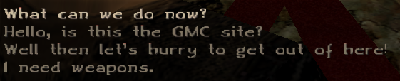

# C_INFO Daedalus class

!!! example "Acknowledgment"
    Heavily inspired by the amazing documentation site [Gothic library](http://www.gothic-library.ru).


The `C_INFO` class is used to define dialogues in the game.
## Class definition
Class definition as it is defined in [`Scripts/Content/_intern/Classes.d`](https://github.com/PhoenixTales/gothic-devkit/blob/48193bef8fd37626f8909853bfc5ad4b7126f176/gothic/_work/data/Scripts/content/_Intern/CLASSES.D#L164) script file.

??? "C_Info Daedalus class"
    ```dae
    class C_Info
    {
        var int    npc;         // npc instance has the dialogue
        var int    nr;          // number of the dialogue (for sorting)
        var int    important;   // should the npc start the dialogue automatically
        var func   condition;   // condition function
        var func   information; // function called on selecting the dialogue
        var string description; // text in the dialogue box
        var int    trade;       // should the dialogue show the trade window
        var int    permanent;   // should the dialogue be permanent or only one time deal
    };
    ```

## Class members

| Variable                    | Type   | Description                                                                         |
|-----------------------------|--------|-------------------------------------------------------------------------------------|
| [npc](#npc)                 | int    | npc instance to have the dialogue                                                   |
| [nr](#nr)                   | int    | dialogue order number                                                               |
| [important](#important)     | int    | npc addresses player automatically                                                  |
| [condition](#condition)     | func   | condition function whether the dialogue is shown or not                             |
| [information](#information) | func   | function called on dialogue selection - contains the dialogue lines and other logic |
| [description](#description) | string | text shown in the dialogue box                                                      |
| [trade](#trade)             | int    | is it a trade dialogue                                                              |
| [permanent](#permanent)     | int    | does the dialogue stay after being played once                                      |


## Class member overview
Description of the class member variables.

### npc
Sets what NPC will have this dialogue instance. Set an NPC instance.
```dae
instance Info_Diego_Gamestart (C_INFO)
{
    npc    = PC_Thief; // NPC instance for Diego
    // ...
};
```

### nr
The `nr` member variables determines the order of shown dialogues. Dialogues are ordered in the ascending order - instances with higher `nr` are below instances with lower `nr`.

```dae
instance Info_Diego_Gamestart (C_INFO)
{
    // ...
    nr = 1;
    // ...
};
```
!!! Note
    This is why the end dialogues usually have `nr = 999;` this is the highest number out of any dialogues therefore will always show up at the bottom. (999 is not the highest number the `nr` can store, it is just considered the highest number, as there will hardly be 998 dialogue instances for a single character)

### important
The `important` member variable determines whether the NPC will automatically address the player or not.

- `important = TRUE` - the NPC will address the player
- `important = FALSE` - the player has to talk to the NPC

When `important` is set to `TRUE`, the description is not needed since the dialogue is never shown in the dialogue box.  
!!! Info  
    If there are multiple important dialogues that satisfy their condition function, they will be played in the order specified by [`nr`](#nr).

!!! Tip  
    `important` variable is of the type integer, and it is initialized by the engine to the value of `0`. If you do not want your dialogue to be important, you can omit the `important` member variable since it will be initialized to `0` by the engine.


### condition
Condition function with signature `func int f()`. If the function returns `TRUE` the dialogue is displayed, if it returns `FALSE` it is not displayed. The function name does not have to follow a particular naming convention, but a naming convention is used throughout all the Gothic scripts: `{DialogueName}_Condition`.

=== "Conditioned dialogue"
    ```dae
    instance Info_Diego_Gamestart (C_INFO)
    {
        // ...
        condition = Info_Diego_Gamestart_Condition;
        // ...
    };

    func int Info_Diego_Gamestart_Condition()
    {
        if (Kapitel < 2) // Show only when chapter is less than 2
        {
            return TRUE;
        };
        return FALSE; // Not needed, but added for readability
    };
    ```
=== "Unconditioned dialogue"
    ```dae
    instance Info_Diego_EXIT_Gamestart(C_INFO)
    {
        // ...
        condition = Info_Diego_EXIT_Gamestart_Condition;
        // ...
    };

    func int Info_Diego_EXIT_Gamestart_Condition()
    {
        return TRUE; // or return 1;
    };
    ```
!!! Tip
    It is unnecessary to return `FALSE` from dialogue conditions, but in other cases it can very rarely cause subtle bugs. It is thus good practice to always return some value, even if that is `FALSE`.


### information
The `information` function contains the function name (without double quotes `""` as `func` is a type in Daedalus) that is called when the dialogue option is selected. It contains the lines NPCs will say, items that will be transferred, quests related logic and much more. The function name does not have to follow a particular naming convention, but a naming convention is used throughout all the Gothic scripts: `{DialogueName}_Info`.

```dae
--8<-- "info_diego_gamestart.d"
```
### description
Specify a string that will be shown in the dialogue window.

```dae
instance DIA_XARDAS_GMC(C_INFO)
{
    // ...
    description = "Hello, is this the GMC site?";
};
```




### trade
If `trade` is set to `TRUE` the trading interface will be launched after the content `information` function is finished.
```dae title="Fisk's trade dialogue"
instance  Stt_311_Fisk_Trade (C_INFO)
{
    npc         = Stt_311_Fisk;
    nr          = 800;
    condition   = Stt_311_Fisk_Trade_Condition;
    information = Stt_311_Fisk_Trade_Info;
    permanent   = TRUE;
    description = "Show me your goods.";
    trade       = TRUE;
};

func int  Stt_311_Fisk_Trade_Condition()
{
    return TRUE;
};

func void  Stt_311_Fisk_Trade_Info()
{
    AI_Output (other, self, "Stt_311_Fisk_Trade_15_00"); //Show me your goods.
};
```

!!! Trivia
    Trade manager has been added to ZenGin not that long before the release of Gothic 1 (as discussed and discovered on [Phoenix the Game Discord server](https://discord.gg/CK4VAR7fpH) with the acquisition of Gothic version `0.94k`). In version 0.94 the trade manager worked quite differently and used a special (nowadays unused) Daedalus class `C_ItemReact`.

### permanent
Dialogues with `permanent = TRUE` do not disappear after the dialogue is played. This is used for dialogues where you ask for directions or flavor dialogues for unnamed NPCs.

!!! Bug
    Frequently used external function `Npc_KnowsInfo` which returns true if the dialogue instance has been played has had a bug in the implementation for a long time. This bug made it impossible to use this function with dialogue instances with `permanent = TRUE` as it would always return `FALSE`. This has been fixed in `Union 1.0m`.

## LeGo
LeGo implements a lot of useful functions for dialogues. It makes it possible to create [Trialogues](../extenders/lego/applications/trialoge.md) and change NPCs behaviour by [Dialoggestures](../extenders/lego/applications/dialoggestures.md). Moreover, any Daedalus function can be added to NPCs AI queue via the [AI_Function](../extenders/lego/tools/ai_function.md) package.

## zParserExtender
zParserExtender implements some Quality of Life features for dialogues. More information can be found in [Dialogue constants article](../extenders/zparserextender/syntax_extensions/dialogues.md).

## AF Script Packet
Enhanced Info Manager (implemented using Ikarus and LeGo) adds tons of customizations and additional features to dialogues. More information can be found in the [AFSP Enhanced Information Manager article](../extenders/afsp/index.md).

## zMultilogue
[zMultilogue](../../union/plugins/zmultilogue.md) union plugin implements a Multi-NPC dialogue system similar to LeGo's [Trialoge](../extenders/lego/applications/trialoge.md) package.