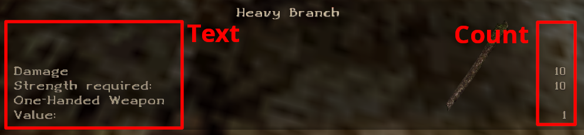
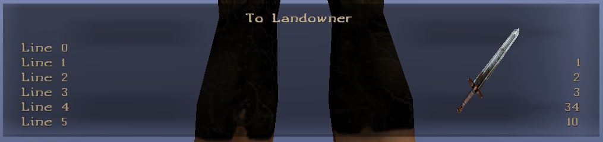

# C_ITEM Daedalus class

!!! example "Acknowledgment"
    Heavily inspired by the amazing documentation site [Gothic library](http://www.gothic-library.ru)

  
The `C_ITEM` class is used to define new items in the game.
## Class definition
Class definition as it is defined in [`Scripts/Content/_intern/Classes.d`](https://github.com/PhoenixTales/gothic-devkit/blob/48193bef8fd37626f8909853bfc5ad4b7126f176/gothic/_work/data/Scripts/content/_Intern/CLASSES.D#L79) script file. 
<details>
  <summary>C_Item Daedalus class</summary>

```dae
class C_Item
{
    // For all Items
    var int    id;                         // ID of the item
    var string name;                       // Name of the item
    var string nameID;                     // Name ID
    var int    hp;                         // Current health of the item
    var int    hp_max;                     // Maximum health of the item

    var int    mainflag;                   // Item category flag
    var int    flags;                      // Item type flag
    var int    weight;                     // Weight of the item
    var int    value;                      // Value of the item

    // For weapons
    var int    damageType;                 // Damage type
    var int    damageTotal;                // Total amount of damage
    var int    damage[DAM_INDEX_MAX];      // Array of damage types

    // For armours
    var int    wear;                       // Flag to specify where to wear an item
    var int    protection[PROT_INDEX_MAX]; // Protection array of different damage types

    // For food
    var int    nutrition;                  // The amount of HP healed

    // Benötigte Attribute zum Benutzen des Items
    var int    cond_atr[3];                // Array of NPC attributes needed to equip the item
    var int    cond_value[3];              // Array of values corresponding to the cond_atr arry

    // Attributes to be changed on equip
    var int    change_atr[3];              // Array of attributes that will be changed on equip
    var int    change_value[3];            // Array of values of the attributes defined in change_atr

    // Parser functions
    var func   magic;
    var func   on_equip;                   // Called on equpping an item
    var func   on_unequip;                 // Called on unequipping an item
    var func   on_state[4];

    var func   owner;                      // Owner of the item: instance name
    var int    ownerGuild;                 // Owner of the item: guild
    var int    disguiseGuild;              // NPC guild set when equipping an item

    // 3DS model file
    var string visual;                     // Item model file

    // NPC mesh change, when equipping an item
    var string visual_change;              // .asc file
    var string effect;                     // Effect instance

    var int    visual_skin;                // Texture variation

    var string scemeName;                  // Animation sceme name
    var int    material;                   // Material of the object

    var int    munition;                   // Ammo instance

    var int    spell;                      // ID if the spell that this item does
    var int    range;                      // Range of the weapon

    var int    mag_circle;                 // Circle of magic needed to use this item

    var string description;                // The name of the item shown in the preview box
    var string text[ITM_TEXT_MAX];         // Array of string describing the item (left side)
    var int    count[ITM_TEXT_MAX];        // Array of integers (the right side)

    // Parameters for displaying items in the inventory
    var int    inv_zbias                   // How far away is the item from the screen
    var int    inv_rotx                    // X-axis rotation
    var int    inv_roty                    // Y-axis rotation
    var int    inv_rotz                    // Z-axis rotation
    var int    inv_animate                 // Should the item rotate in the inventory
};
```

</details>

It has many member variables but not all of them are used for every item. It is not necessary to define every one of these variables for every item as it was discussed on [InsideGothic](https://ataulien.github.io/Inside-Gothic/objects/item/).

## Class members
A selection of the most important class members.

### change_atr & change_value 
  `change_atr` stores the attributes that will be changed by the amount specified in `change_value`.

NPCs have these attributes:
```dae
const int ATR_HITPOINTS      =  0;  // Hit points
const int ATR_HITPOINTS_MAX  =  1;  // Max hitpoints
const int ATR_MANA           =  2;  // Mana
const int ATR_MANA_MAX       =  3;  // Max mana

const int ATR_STRENGTH       =  4;  // Strength
const int ATR_DEXTERITY      =  5;  // Dexterity
const int ATR_REGENERATEHP   =  6;  // HP regeneration per second
const int ATR_REGENERATEMANA =  7;  // Mana regeneration per second
```

This can be used on all equipable items to change the attributes. As an example we can create a sword that has a 10 point dexterity bonus.

```dae
instance ItMw_testSword (C_Item)
{
    // some code
    change_atr[0]   = ATR_DEXTERITY;
    change_value[0] = 10;
    // some code
};
```  

!!! Warning
    Do not change `ATR_HITPOINTS`, `ATR_MANA`, `ATR_HITPOINTS_MAX` or `ATR_MANA_MAX` as it will result in unwanted behaviour with max health or max mana.

You can change `ATR_HITPOINTS_MAX` and `ATR_MANA_MAX` attributes in [on_equip](#class-definition) and [on_unequip](#class-definition)

### cond_atr & cond_value
 `cond_atr` stores the attributes that will be checked as a requirement to equip an item, the amount specified in `cond_value`.

The next example sword is equipable only if the NPC has at least 5 strength. If the requirements are not met [`G_CanNotUse()`](https://github.com/PhoenixTales/gothic-devkit/blob/main/gothic/_work/data/Scripts/content/_Intern/G_Functions/G_CanNotUse.d) is called.
```dae
instance ItMw_testSword (C_Item)
{
    // some code
    cond_atr[2]     = ATR_STRENGTH;
    cond_value[2]   = 5;
    // some code
};
```
  
Try injecting the code below [zParserExtender](../../scripts/extenders/zparserextender/injection.md) to test it in game right away. It is compatible with G2NotR.

```dae
instance ItMw_testSword (C_Item)
{
    name            = TXT_Spells[10]; // demonstrates the usage of direct constr array access
    
    mainflag        = ITEM_KAT_NF;
    flags           = ITEM_SWD;
    material        = MAT_METAL;
    
    value           = 10;
    
    damageTotal     = 10;
    damagetype      = DAM_EDGE;
    range           = 100;
    
    cond_atr[2]     = ATR_STRENGTH;
    cond_value[2]   = 5;
    
    change_atr[0]   = ATR_DEXTERITY;
    change_value[0] = 10;
    
    visual          = "ItMw_010_1h_Sword_short_01.3DS";
    
    description     = name;
    
    TEXT[2]         = NAME_Damage;      COUNT[2] = damageTotal;
    TEXT[3]         = NAME_Str_needed;  COUNT[3] = cond_value[2];
    TEXT[4]         = NAME_OneHanded;
    TEXT[5]         = NAME_Value;       COUNT[5] = value;
};
```
To insert it into the game use `insert ItMw_testSword` in console.

### text & count arrays
These two arrays are used to put information into the item information box. 

The maximum number of lines is 6. This is defined in the engine, but for script side class definition is declared in the scripts too.
```dae
const int ITM_TEXT_MAX = 6;
```
This example shows an item with all elements of `TEXT` and `COUNT` array filled. 

!!! note
    Please notice the last `COUNT` element. It did not take the value we entered, but shows `10` which is the `value` of the item. This behaviour can be changed with Ikarus or Union.
    


You can find the code below
```dae
instance ItMw_testSword (C_Item)
{
    name          = TXT_Spells[10];

    mainflag      = ITEM_KAT_NF;
    flags         = ITEM_SWD;
    material      = MAT_METAL;

    value         = 10;

    damageTotal   = 10;
    damagetype    = DAM_EDGE;
    range         = 100;

    cond_atr[2]   = ATR_STRENGTH;
    cond_value[2] = 5;

    change_atr[0] = ATR_DEXTERITY;
    change_value[0] = 10;

    visual        = "ItMw_010_1h_Sword_short_01.3DS";

    description   = name;

    TEXT[0]       = "Line 0";     COUNT[0]      = 0; 
    TEXT[1]       = "Line 1";     COUNT[1]      = 1; 
    TEXT[2]       = "Line 2";     COUNT[2]      = 2; 
    TEXT[3]       = "Line 3";     COUNT[3]      = 3; 
    TEXT[4]       = "Line 4";     COUNT[4]      = 34;
    TEXT[5]       = "Line 5";     COUNT[5]      = 35;
};
```


### description & name
`description` - determines the name of the item in the inventory

`name` - determines the focus name of the item in the world

In the scripts you often find that the description is assigned the value of `name`.
```dae
instance ItMw_testSword (C_Item)
{
    name = "New amazing sword";
    // ...
    description   = name; // description now has the same value as '    // ...name'
    // ...
};
```
This is used in the case where you want to show the name of the item on focus too.

There is a second way used in the scripts though with, for example,magic scrolls - the focus name in the world is "Scroll" and in inventory the scroll carries the name of the spell. This is how it is done:
```dae
instance ItSc_InstantFireball (C_Item)
{
	name 				=	NAME_Spruchrolle; // const string = "Scroll"
    // ...
	description			= 	NAME_SPL_InstantFireball; // const string = "Fireball"
    // ...
};
```


[comment]: <> ( ### damage & damageType & damageTotal)
[comment]: <> ( TODO: This is very cool)

[comment]: <> ( ### disguiseGuild)
[comment]: <> ( Allows you to change an apparent guild while wearing the item.)

[comment]: <> ( TODO )

### hp & hp_max
Both of these parameters are unused.

!!! Trivia
    In alpha ZenGin versions the player was able to destroy objects. This feature was abandoned during the course of the development.  
    This video shows the reconstruction of this feature.  
    
