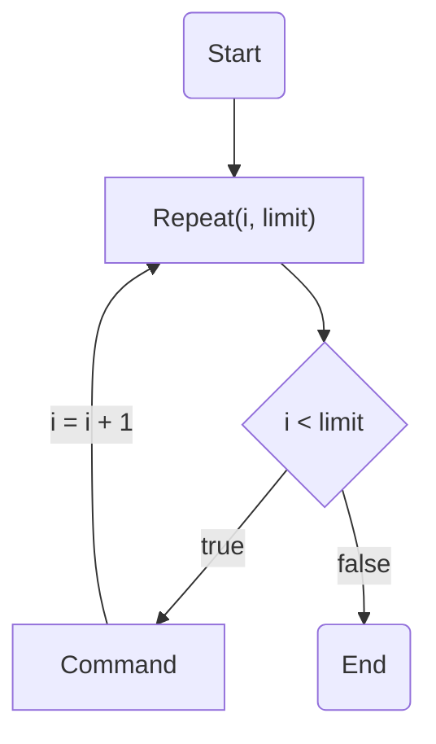

# Jumps and Loops

## Jumps

Jumps in Ikarus are implemented by direct manipulation of the stack pointer, achieved with two lines of code. These lines enable the change of the current position within the parser stack, representing machine-level code generated during script compilation. By querying and setting this position, the execution flow can be redirected to a new location in the code.

### Initialization

To ensure the correct functioning of this jump mechanism, it is crucial to execute the `MEM_InitLabels()` function once after loading a saved game. The recommended practice is to integrate this initialization function within `INIT_GLOBAL`. It's only after `MEM_InitLabels()` has been called that accessing `MEM_StackPos.position` becomes valid.

```dae
func void MEM_InitLabels()
```
!!! Tip
    It's worth noting that `MEM_InitLabels` is also invoked by the `MEM_InitAll` function.

### Usage
- **Label Initialization**   
    Before attempting a jump, it's important to initialize the label to which the jump is intended. Forward jumps, where the jump point is encountered before the jump target, can be challenging. Label initialization looks like that:
    ```dae
    // [...]
    var int label;
    label = MEM_StackPos.position;
    // [...]
    ```
- **Actual jump**   
    After initializing the label you could simply jump to it by setting `MEM_StackPos.position` to the label.
    ```dae
    // [...]
    MEM_StackPos.position = label;
    // [...]
    ```

**Jump flowchart**
    ```mermaid
    flowchart TD
    A(Start) --> B["var int label; \n label = MEM_StackPos.position;"];
    B --> C{Your code}
    C -->D["MEM_StackPos.position = label;"];
    C --> E(End)
    D --> |Jump| B;
    ```
### Notes and warnings

- **Validity of Labels**   
    Labels become invalid after saving and loading. Consequently, labels should be used immediately, and there is generally no reason to persist them for an extended period.

- **Caution with Jumping**   
    Jumping between different functions without a clear understanding of the code structure can lead to unexpected issues. Similarly, using labels without a thorough comprehension of their purpose may result in undesired consequences. It's crucial to exercise caution, especially when making assignments involving labels.


### Examples

=== "Simple jump 'loop'"
    The following code outputs the numbers from 0 to 42:

    ```dae
    func void foo() {
        /* Initialization */
        MEM_InitLabels();
        var int count; count = 0;
        
        /* Record the execution position in label. */
        var int label;
        label = MEM_StackPos.position;
        /* <---- label now points here,
        * i.e. to the position AFTER the assignment of label. */
        
        Print (ConcatStrings ("COUNT: ", IntToString (count)));
        count += 1;
        
        if (count <= 42) {
            /* Replace the execution position,
            * with the "<-----" the system then continues */
            MEM_StackPos.position = label;
        };
        
        /* Once 43 is reached, the “loop” is exited. */
    };
    ```
=== "Nested jump 'loop'"
    The following code should enumerate all pairs (x,y) with `0 <= x < max_x`, `0 <= y < max_y`
    ```dae
    func void printpairs(var int max_x, var int max_y)
    {
        // Initialize labels
        MEM_InitLabels();
        // PrintDebug should be used, i.e. activate debug output
        MEM_SetShowDebug (1);

        var int x; var int y; x = 0;

        // while (x < max_x)
        var int x_loop; x_loop = MEM_StackPos.position;
        if (x < max_x)
        { 
            y = 0;
            // while (y < max_y) 
            var int y_loop; y_loop = MEM_StackPos.position;
            if (y < max_y)
            { 
                var string out; out = "(";
                out = ConcatStrings (out, IntToString (x));
                out = ConcatStrings (out, ", ");
                out = ConcatStrings (out, IntToString (y));
                out = ConcatStrings (out, ")");
                PrintDebug (out);
                y += 1;

                // continue y_loop 
                MEM_StackPos.position = y_loop;
            };
            x += 1;
            // continue x_loop
            MEM_StackPos.position = x_loop;
        };
    };

    /*
        Output of a call printpairs(4,2) would then be: 
        00:36 Info: 5 U: Skript: (0, 0) .... 
        00:36 Info: 5 U: Skript: (0, 1) .... 
        00:36 Info: 5 U: Skript: (1, 0) .... 
        00:36 Info: 5 U: Skript: (1, 1) .... 
        00:36 Info: 5 U: Skript: (2, 0) .... 
        00:36 Info: 5 U: Skript: (2, 1) .... 
        00:36 Info: 5 U: Skript: (3, 0) .... 
        00:36 Info: 5 U: Skript: (3, 1) .... 
    */
    ```

## Label and Goto

Besides the normal [jumps](#jumps) Ikarus implements `MEM_Label` and `MEM_Goto` functions. They work similar to the stack manipulation with `var int label` but the interface is much more user-friendly and defining new variables is not needed.

### `MEM_Label`
Function that works like a `label = MEM_StackPos.position;`. You could jump to it with [`MEM_Goto`](#mem_goto).
```dae
func void MEM_Label(var int lbl)
```
**Parameters**

- `#!dae var int lbl`   
    Number of the label, used for nested loop or multiple loops within one function

### `MEM_Goto`
Function that works like a `MEM_StackPos.position = label;`. Executes a jump to a [`MEM_Label`](#mem_label) with specified number.
```dae
func void MEM_Goto(var int lbl)
```
**Parameters**

- `#!dae var int lbl`   
    Number of the label, the function will jump to

### Usage
Usage of Label and Goto is probably self-explanatory, since it is same as in the regular Ikarus Jump. But before using it reading the [Notes and warnings](#notes-and-warnings) of the Jumps is recommended.

**Label-Goto loop flowchart**
    ```mermaid
    flowchart TD
    A(Start) --> B["MEM_Label(0);"];
    B --> C{Your code}
    C -->D["MEM_Goto(0);"];
    C --> E(End)
    D --> |Jump| B;
    ```

```dae title="Label-Goto loop"
func void LabelGoto_test() {
    var int i; 
    MEM_Label(0);
        MEM_Debug(IntToString(i));
        i = i + 1;
        if(i >= 4)
        {
            return;
        };
        MEM_Goto(0);
};

//  Results:
//  Info:  0 Q:     Debug: 0
//  Info:  0 Q:     Debug: 1
//  Info:  0 Q:     Debug: 2
//  Info:  0 Q:     Debug: 3
```

### Examples

=== "Simple Label-Goto 'loop'"
    The following code outputs the numbers from 0 to 42:

    ```dae
    func void foo() {
        var int count; count = 0;

        MEM_Label(0);
        /* <---- label now points here,
        * i.e. to the position AFTER the assignment of label. */
        
        Print (ConcatStrings ("COUNT: ", IntToString (count)));
        count += 1;
        
        if (count <= 42) {
            // Jump to the MEM_Label
            MEM_Goto(0);
        };
        
        /* Once 43 is reached, the “loop” is exited. */
    };
    ```
=== "Nested Label-Goto 'loop'"
    The following code should enumerate all pairs (x,y) with `0 <= x < max_x`, `0 <= y < max_y`
    ```dae
    func void printpairs(var int max_x, var int max_y)
    {
        // PrintDebug should be used, i.e. activate debug output
        MEM_SetShowDebug (1);

        var int x; var int y; x = 0;

        // while (x < max_x)
        MEM_Label(0);
        if (x < max_x)
        { 
            y = 0;
            // while (y < max_y) 
            MEM_Label(1);
            if (y < max_y)
            { 
                var string out; out = "(";
                out = ConcatStrings (out, IntToString (x));
                out = ConcatStrings (out, ", ");
                out = ConcatStrings (out, IntToString (y));
                out = ConcatStrings (out, ")");
                PrintDebug (out);
                y += 1;

                MEM_Goto(1);
            };
            x += 1;
           MEM_Goto(0);
        };
    };

    /*
        Output of a call printpairs(4,2) would then be: 
        00:36 Info: 5 U: Skript: (0, 0) .... 
        00:36 Info: 5 U: Skript: (0, 1) .... 
        00:36 Info: 5 U: Skript: (1, 0) .... 
        00:36 Info: 5 U: Skript: (1, 1) .... 
        00:36 Info: 5 U: Skript: (2, 0) .... 
        00:36 Info: 5 U: Skript: (2, 1) .... 
        00:36 Info: 5 U: Skript: (3, 0) .... 
        00:36 Info: 5 U: Skript: (3, 1) .... 
    */
    ```

## While loop

Ikarus also implements a while loop. Its syntax isn't as good as the loop from [zParserExtender](../../zparserextender/syntax_extensions/while.md), due to the daedalus limitations, but it works as a normal while loop that can be found in many programming languages.

### Syntax
The Ikarus while loop consist of three things:

- **while function**   
That works like a while statement and start of the brace `while(var int b){`.
```dae
func void while(var int b)
```

- **end constant**   
That works like an ending brace `}`.
```dae
const int end = -72;
```

- **break and continue constant**   
These two constants works like a regular `break` and `continue` statements in C.
```dae
const int break = -42;
const int continue = -23;
```

```dae title="while loop"
func void while_test() {
    var int value; value = 10;
    while(value > 0); //{

        if (value == 8)
        {
            continue;
        };
    
        if (value == 2)
        {
            break;
        };
    end; //}
};
```

### Examples

=== "Simple while loop"
    The following code outputs the numbers from 0 to 42:

    ```dae
    func void foo() {
        var int count; count = 0;
        while(count <= 42); //{
            Print (ConcatStrings ("COUNT: ", IntToString (count)));
            count += 1;
        end; //}
        
        /* Once 43 is reached, the loop is exited. */
    }; 
    ```
=== "Nested while loop"
    The following code should enumerate all pairs (x,y) with `0 <= x < max_x`, `0 <= y < max_y`
    ```dae
    func void printpairs(var int max_x, var int max_y)
    {
        // PrintDebug should be used, i.e. activate debug output
        MEM_SetShowDebug (1);

        var int x; var int y; x = 0;

        while(x < max_x); //{
            y = 0;
            while(y < max_y); //{  
                var string out; out = "(";
                out = ConcatStrings (out, IntToString (x));
                out = ConcatStrings (out, ", ");
                out = ConcatStrings (out, IntToString (y));
                out = ConcatStrings (out, ")");
                PrintDebug (out);
                y += 1;
            end; //}
            x += 1;
        end; //}
    };

    /*
        Output of a call printpairs(4,2) would then be: 
        00:36 Info: 5 U: Skript: (0, 0) .... 
        00:36 Info: 5 U: Skript: (0, 1) .... 
        00:36 Info: 5 U: Skript: (1, 0) .... 
        00:36 Info: 5 U: Skript: (1, 1) .... 
        00:36 Info: 5 U: Skript: (2, 0) .... 
        00:36 Info: 5 U: Skript: (2, 1) .... 
        00:36 Info: 5 U: Skript: (3, 0) .... 
        00:36 Info: 5 U: Skript: (3, 1) .... 
    */
    ```

## Repeat loop

In addition Ikarus implements something called **Repeat loop**. 

### Initialization

To use Repeat loop you must first call `MEM_InitRepeat()` function once after loading a saved game. The recommended practice is to integrate this initialization function within `INIT_GLOBAL`.

```dae
func void MEM_InitRepeat()
```
!!! Tip
    It's worth noting that `MEM_InitRepeat` is also invoked by the `MEM_InitAll` function.


### Syntax
Repeat loop has a syntax very similar to the [while loop](#syntax). It also uses `end` constant as an ending brace. `break` and `continue` statements can be used within it as well. The main difference is the main loop function `Repeat` that has following properties:

```dae
func void Repeat(var int variable, var int limit)
```

- `#!dae var int variable`   
    A variable that increase with every loop iteration.
- `#!dae var int limit`   
    A variable that defines the number of loop iterations. If `variable >= limit` the loop is exited.

**Repeat loop flowchart**



```dae title="Repeat loop"
func void Repeat_test() {
    Repeat(i, 4); var int i; //{
        MEM_Debug(IntToString(i));
    end; //}
};

//  Results:
//  Info:  0 Q:     Debug: 0
//  Info:  0 Q:     Debug: 1
//  Info:  0 Q:     Debug: 2
//  Info:  0 Q:     Debug: 3
```

### Examples

=== "Simple Repeat loop"
    The following code outputs the numbers from 0 to 42:

    ```dae
    func void foo() {
        Repeat(count, 43); var int count; //{
            Print (ConcatStrings ("COUNT: ", IntToString (count)));
        end; //}
        
        /* Once 43 is reached, the loop is exited. */
    }; 
    ```
=== "Nested Repeat loop"
    The following code should enumerate all pairs (x,y) with `0 <= x < max_x`, `0 <= y < max_y`
    ```dae
    func void printpairs(var int max_x, var int max_y)
    {
        // PrintDebug should be used, i.e. activate debug output
        MEM_SetShowDebug (1);

        var int x; var int y; x = 0;

        Repeat(x, max_x); //{
            y = 0;
            Repeat(y, max_y); //{  
                var string out; out = "(";
                out = ConcatStrings (out, IntToString (x));
                out = ConcatStrings (out, ", ");
                out = ConcatStrings (out, IntToString (y));
                out = ConcatStrings (out, ")");
                PrintDebug (out);
            end; //}
        end; //}
    };

    /*
        Output of a call printpairs(4,2) would then be: 
        00:36 Info: 5 U: Skript: (0, 0) .... 
        00:36 Info: 5 U: Skript: (0, 1) .... 
        00:36 Info: 5 U: Skript: (1, 0) .... 
        00:36 Info: 5 U: Skript: (1, 1) .... 
        00:36 Info: 5 U: Skript: (2, 0) .... 
        00:36 Info: 5 U: Skript: (2, 1) .... 
        00:36 Info: 5 U: Skript: (3, 0) .... 
        00:36 Info: 5 U: Skript: (3, 1) .... 
    */
    ```