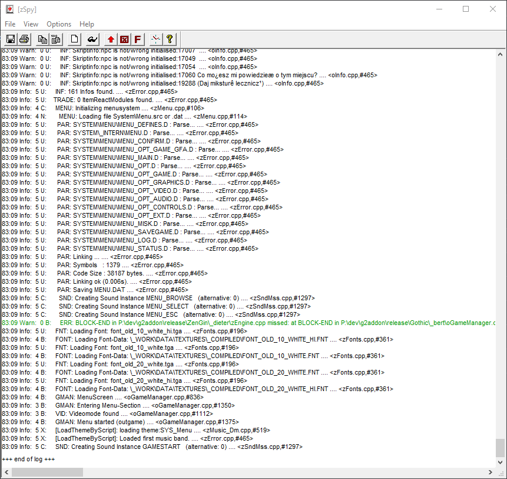

# zSpy
**zSpy** is a debugging tool that displays most of the operations performed by the engine during the Gothic or Spacer running.

??? example "Example image of running zSpy"
    

!!! Warning
    zSpy must be started before Gothic or the Spacer is started so that the program can find it. Sometimes in Gothic I this has to be done manually, in Gothic II This is done by the GothicStarter_mod. 

In order to be able to follow the messages in zSpy, Gothic should be started in the window. The corresponding startup option can be found in GothicStarter (mod). Within Gothic, when Marvin mode is activated, you can switch between window and full-screen mode at any time with the `F3` key.

## Log Level 
With the `-zlog#` command in GothicStarter, you can specify how many messages zSpy will output. `#` can be a number between -1 and 9. Used for: 

- `-1` - Disable every message (expect fatal errors)

- `0` - Shows only warnings, faults and fatal errors

- `1 - 9` - Display more information. Every Information has their priority. If you select 1, the program displays only messages with priority `=< 1`, with 5 only priority `=< 5`, and with 9, almost everything that Gothic can produce. 

For general debugging, recommended value is 5.

## Output
The zSpy issues its reports in the following form: 

```
Time  Type  Priority  User   Message              ...      <filename,       #line>
00:21 Info:  3        B:     GOTHIC: Exiting game ... .... <oGameManager.cpp,#617>
```

### Time
Time elapsed since the start of Gothic.exe

### Type
Type of message. The following message types are distinguished:

- `Fatal:` - Critical error causing application to close. 

- `Fault:` - A simple bug that will not cause the application to stop, but display or performance issues may occur. 

- `Warn:` - A warning of possible consequences. An error that follows soon afterwards could have something to do with it. 

- `Info:` - General information about the progress of the program. 

### Priority
Priority level of the message. Messages with lower priority (higher number) can be disabled. See [log level](#log-level).

### User
User ID - a letter defined by every engine developer to highlight its logs

- `D` - Dieter
- `U` - Ulf 
- `B` - Bert 
- `C` - Carsten
- `A` - Andre
- `X` - Kurt

### Message
The most important part. A message that contains:

- Symbol representing a program module. The names are mostly self-explanatory, so there is no need to type them all (`MDL` = 3D models, `PAR` = Parser etc.).

- The message for the user.

## Configuration
In zSpy, you can customize the font and its color depending on the type of message. 

In addition, you can configure the logging options:

- Filtering various messages (Info, Warn, Fault, Fatal).
- Auto show/hide zSpy when starting/stopping Gothic.
- Saving the log file to a separate file.


## Console commands
List of console commands related with zSpy.
!!! Note
    The list is work in progress. Console commands needs a separate article or section.

### `zerr level`
Sets a [level of logging](#log-level).
```
zerr level <#>
```  

- `<#>` - max message priority. See [log level](#log-level).

### `zerr searchspy`
Links zSpy with Gothic. Useful when you run zSpy when the game is already running.
```
zerr searchspy
```

### `zerr authors`
Sets a filter to display only messages of one author. 
```
zerr authors <letter>
```

- `<letter>` - One of the letters listed [here](#user).

### `zerr rem`
Includes a remark into the log.
```
zerr rem
``` 
Looks like that:

```
00:46 Info:  3 B:       OPT: Blood-Details: Value=2 .... <oGameManager.cpp,#1302>
00:57 ---------------
00:57 ---------------
01:01 Info:  3 B:     GMAN: Leaving Menu-Section .... <oGameManager.cpp,#1537>
```

### `zerr status`
Displays a current status of zSpy in the console.
```
zerr status
```

